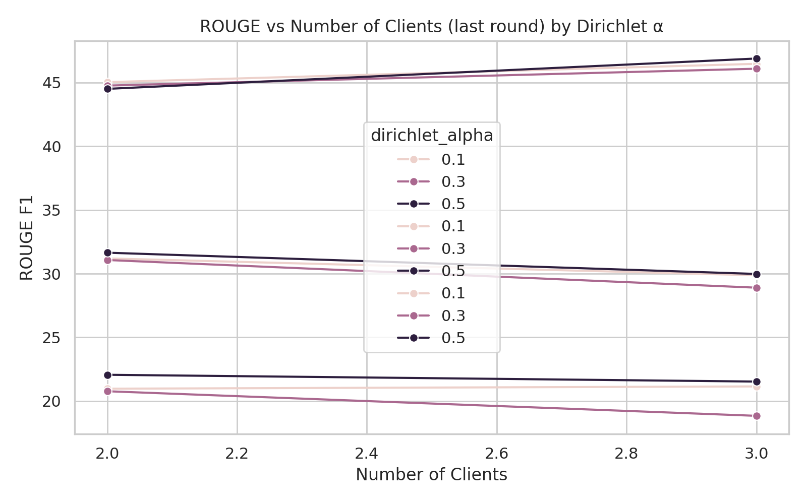
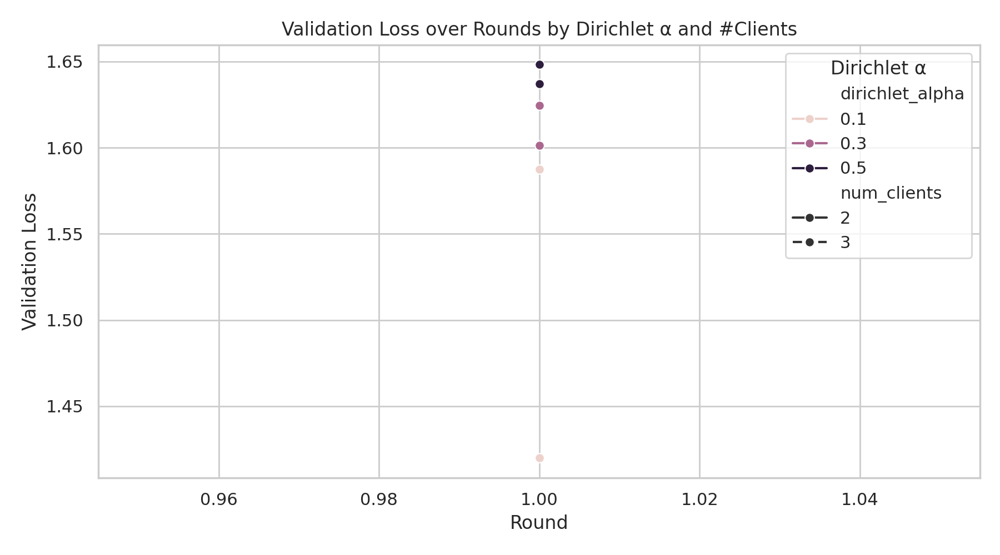
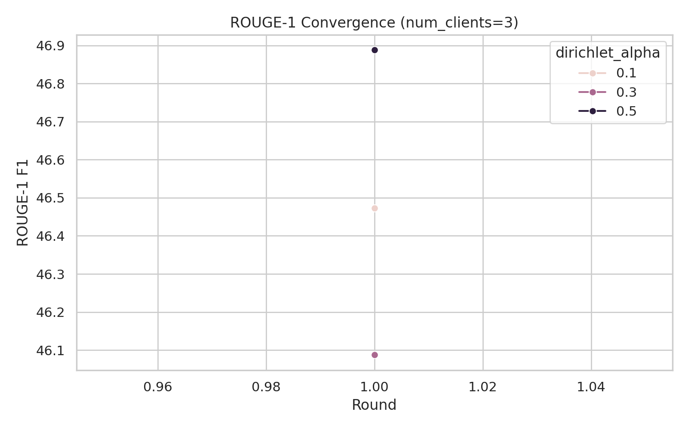
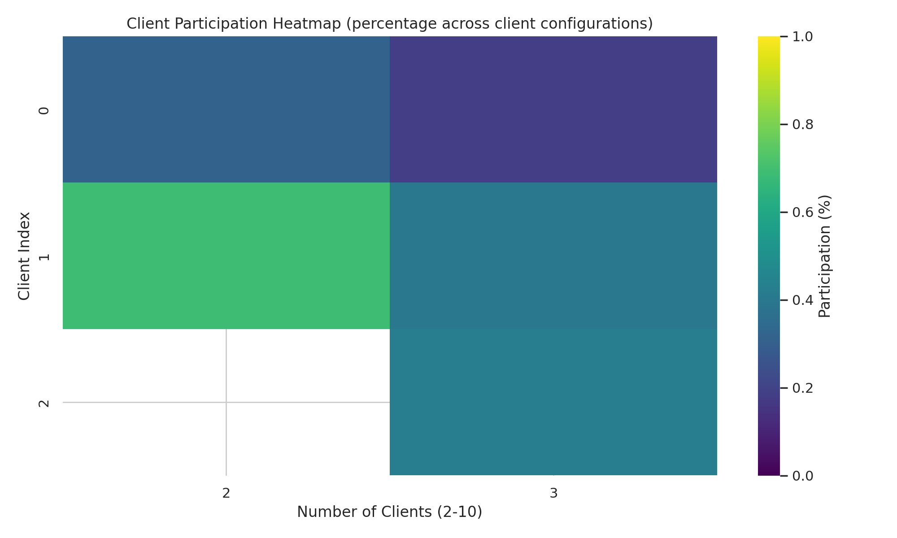

# Federated Abstractive Summarization: Non-IID Analysis of DistilBART and BART (CNN/DailyMail)

## Abstract
- We study the effect of client count and non-IID data (Dirichlet α) on federated fine-tuning for abstractive summarization.
- We use DistilBART runs (α ∈ {0.1, 0.5}, clients 2–10, 5 rounds) and report ROUGE/BLEU, loss, and contribution dispersion.
- We discuss model-size trade-offs between DistilBART and BART, noting efficiency vs potential peak quality.

## Methodology
- Task: CNN/DailyMail summarization (pretrained DistilBART; BART for qualitative comparison).
- Federated setup: number of clients ∈ {2..10}, rounds = 5.
- Non-IID partitioning: Dirichlet with concentration parameter α (lower α ⇒ stronger skew).
- Metrics: ROUGE-1/2/L F1, BLEU-1/2/3/4, training loss; contribution dispersion (Gini, CV); participation heatmap.
- Consolidated metrics CSV: `experiment_results/analysis/consolidated_metrics_distil_gen_fed.csv`.

## Experiments
- Each n-client configuration is saved under `results_distilbart_cnndm_federated/nc_{N}/run_*`.
- Per-run data distribution is logged to `client_contributions/client_metrics.csv` and `summary.json`.
- Visualizations and consolidated metrics are generated by:
  - `tools/consolidate_distilbart_metrics.py`
  - `tools/visualize_consolidated_metrics.py` (supports `--split-by-alpha`)
  - `tools/visualize_data_distribution.py`

### Reproduce: Dirichlet α sweep (0.5, 0.1)

Run a 2–10 client sweep for 5 rounds for both α=0.5 and α=0.1:

```bash
for a in 0.5 0.1; do \
  /mnt/sda1/Projects/jsl/vp_gitlab/FED/FED-OPT-BERT/FED-OPT-BERT-main/.venv/bin/python \
    tools/run_distilbart_experiments.py \
    --config configs/distilbart_cnndm_federated.yaml \
    --min-clients 2 --max-clients 10 \
    --num-rounds 5 \
    --extra \
    --dirichlet_alpha "$a"; \
done
```

Outputs will be saved under `results_distilbart_cnndm_federated/nc_{N}/run_*` and consolidated to `experiment_results/analysis/consolidated_metrics_distil_gen_fed.csv`.

## Results and Discussion

### Q1. Impact of model size (DistilBART vs BART)
- Key points:
  - DistilBART is more compute/memory efficient, enabling broader client sweeps and faster iteration.
  - BART (larger capacity) can reach higher absolute quality given sufficient rounds/resources, but is more sensitive to non-IID skew and OOM risk.

#### Figures (BART-Large vs DistilBART)

<p align="center">
  
</p>
<sub>Figure: ROUGE-1/2/L F1 vs number of clients (last round), comparing DistilBART and BART-Large.</sub>

<p align="center">
  
</p>
<sub>Figure: BLEU-1/2/3/4 vs number of clients (last round), comparing DistilBART and BART-Large.</sub>

<p align="center">
  
</p>
<sub>Figure: ROUGE-1 convergence across rounds at 10 clients, comparing DistilBART and BART-Large.</sub>

Data (merged): `experiment_results/analysis/compare_bart_distil/consolidated_metrics_compare_bart_vs_distil.csv`

---

### Full visual gallery and CSV sources

#### DistilBART (results_distilbart_cnndm_federated)

<p align="center">
  
</p>
<sub>ROUGE-1/2/L vs number of clients (overlay across alphas).</sub>

<p align="center">
  
</p>
<sub>ROUGE-1/2/L vs number of clients at α=0.1.</sub>

<p align="center">
  
</p>
<sub>ROUGE-1/2/L vs number of clients at α=0.5.</sub>

<p align="center">
  
</p>

<p align="center">
  
</p>

<p align="center">
  
</p>

<p align="center">
  
</p>

<p align="center">
  
</p>

<p align="center">
  
</p>

<p align="center">
  
</p>
<sub>Participation heatmap: y-axis client indices (0–9), x-axis client counts (2–10). Values are % contribution per configuration.</sub>

CSV sources:

- `experiment_results/analysis/consolidated_metrics_distil_gen_fed.csv`
- Per-config: `results_distilbart_cnndm_federated/nc_{N}/run_*/metrics.csv`
- Contributions: `results_distilbart_cnndm_federated/nc_{N}/run_*/client_contributions/client_metrics.csv`

#### BART-Large (results_bart_cnndm_federated)

<p align="center">
  
</p>

<p align="center">
  
</p>

<p align="center">
  
</p>

<p align="center">
  
</p>

<p align="center">
  
</p>

CSV sources:

- `results_bart_cnndm_federated/consolidated_metrics_bart_large_fed_gen.csv`
- `results_bart_cnndm_federated/metrics_summary.csv`
  - Under stronger skew (lower α), both models degrade; DistilBART’s efficiency helps maintain feasible training across more clients.
- Recommendation: For constrained compute or many clients, DistilBART is a strong practical choice; add BART runs where peak quality is critical and resources permit.

### Q2. Effect of number of clients
- Figures:
  - ROUGE vs clients (overlay by α): `results_distilbart_cnndm_federated/rouge_metrics.png`
  - BLEU vs clients (overlay by α): `results_distilbart_cnndm_federated/bleu_metrics.png`
- Observations:
  - As clients increase, communication/aggregation variance grows; mild quality drop is typical.
  - Degradation is more noticeable at α=0.1 than α=0.5.
  - Small client counts (e.g., 2–3) tend to show higher and more stable ROUGE/BLEU.

### Q3. Effect of non-IID distribution (Dirichlet α)
- Per-α (BART-style per-config) plots:
  - ROUGE: `results_distilbart_cnndm_federated/rouge_metrics_alpha_0.1.png`, `.../rouge_metrics_alpha_0.5.png`
  - BLEU: `results_distilbart_cnndm_federated/bleu_metrics_alpha_0.1.png`, `.../bleu_metrics_alpha_0.5.png`
  - Loss: `results_distilbart_cnndm_federated/training_loss_alpha_0.1.png`, `.../training_loss_alpha_0.5.png`
  - Convergence (nc=10): `results_distilbart_cnndm_federated/rouge1_convergence_alpha_0.1.png`, `.../rouge1_convergence_alpha_0.5.png`
- Participation & contributions:
  - Heatmap (percent contribution per client across client configurations 2–10; x: number of clients; y: client index):
    `results_distilbart_cnndm_federated/participation_heatmap.png`
  - Contribution dispersion:
    `results_distilbart_cnndm_federated/contribution_distribution.png`, `results_distilbart_cnndm_federated/gini_vs_clients.png`
- Observations:
  - α=0.1 (strong skew) shows greater contribution imbalance (higher Gini/CV) and typically lower ROUGE/BLEU than α=0.5.
  - α=0.5 mitigates skew; metrics are more consistent across client counts.

## Reproducibility

### Training (dual α sweep)
```bash
for a in 0.5 0.1; do \
  .venv/bin/python tools/run_distilbart_experiments.py \
    --config configs/distilbart_cnndm_federated.yaml \
    --min-clients 2 --max-clients 10 \
    --num-rounds 5 --extra --dirichlet_alpha "$a"; \
done
```

### Consolidation
```bash
.venv/bin/python tools/consolidate_distilbart_metrics.py \
  results_distilbart_cnndm_federated \
  experiment_results/analysis/consolidated_metrics_distil_gen_fed.csv
```

### Visualization (overlay + per-alpha)
```bash
.venv/bin/python tools/visualize_consolidated_metrics.py \
  --csv experiment_results/analysis/consolidated_metrics_distil_gen_fed.csv \
  --out-dir results_distilbart_cnndm_federated \
  --conv-nc 10 --split-by-alpha

.venv/bin/python tools/visualize_data_distribution.py \
  --base results_distilbart_cnndm_federated \
  --out-dir results_distilbart_cnndm_federated
```

## Files
- Consolidated: `experiment_results/analysis/consolidated_metrics_distil_gen_fed.csv`
- Figures (DistilBART federated):
  - Overlay: `rouge_metrics.png`, `bleu_metrics.png`, `training_loss.png`, `rouge1_convergence.png`
  - Per-α: `rouge_metrics_alpha_{α}.png`, `bleu_metrics_alpha_{α}.png`, `training_loss_alpha_{α}.png`, `rouge1_convergence_alpha_{α}.png`
  - Distribution: `participation_heatmap.png`, `contribution_distribution.png`, `gini_vs_clients.png`
